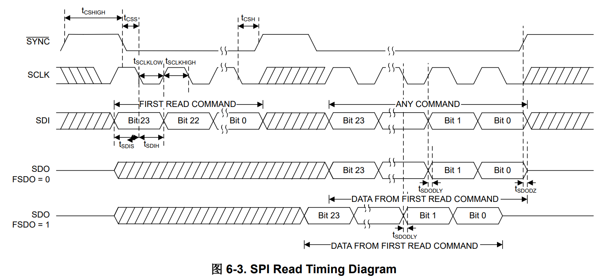
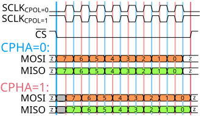

# SPI通讯

该芯片的SPI接口是非常规设计。

它的基础设置是常见的，Motorola格式，8bits，MSB First；因为24bit一组，只能选择软NSS实现。初始调试时Prescaler可以使用较低的Baud rate，例如50M外设总线时钟时选64，产生781.25KBits/s的波特率。


如果只需要写入，CPOL=1，CPHA=0，即SPI mode 2是可以的；但是如果要读取，读取需要两个Transaction：

- 第一个transaction和写入一样，使用CPOL=1, CPHA=0的设置；
- 第二次transaction的CPOL=0，因为CS下降沿之后是SCLK的上升沿；而CPHA取决于interface-config寄存器的FSDO设置，
  - 如果FSDO为0，如图所示，sample data已经是第二个边沿了，即CPHA=1；
  - 如果FSDO为1，sample data发生在上升沿，是第一个边沿，即保持CPHA=0；





实际代码选择了FSDO=1的设置，即interface-config写入了0x0005；一方面FSDO的CLK速度可以略高一点，另一方面在两次transaction之间只需要修改CPOL。


# 设置

## 参考

官方文档给了一个参考，是电源的margin应用：

```
//SYNTAX: WRITE <REGISTER NAME (Hex code)>, <MSB DATA>, <LSB DATA>
//Write DAC code for nominal output (repeat for all DAC channels)
//For a 1.8-V output range, the 10-bit hex code for 0.6 V is 0x155. With 16-bit left alignment,
this becomes 0x5540
WRITE DAC_0_DATA(0x1C), 0x55, 0x40
//Power-up voltage output on both the channels, enables internal reference
WRITE COMMON-CONFIG(0x1F), 0x12, 0x01
//Set channel 0 gain setting to 1.5x internal reference (1.8 V)
WRITE DAC-0-VOUT-CMP-CONFIG(0x15), 0x08, 0x00
//Set channel 1 gain setting to 1.5x internal reference (1.8 V)
WRITE DAC-1-VOUT-CMP-CONFIG(0x3), 0x08, 0x00
//Configure GPI for Margin-High, Low trigger for all channels
WRITE GPIO-CONFIG(0x24), 0x01, 0x35
//Set slew rate and code step (repeat for all channels)
//CODE_STEP: 2 LSB, SLEW_RATE: 60.72 µs/step
WRITE DAC-0-FUNC-CONFIG(0x18), 0x00, 0x17
//Write DAC margin high code (repeat for all channels)
//For a 1.8-V output range, the 10-bit hex code for 1.164 V is 0x296. With 16-bit left alignment,
this becomes 0xA540
WRITE DAC-0-MARGIN-HIGH(0x13), 0xA5, 0x40
//Write DAC margin low code (repeat for all channels)
//For a 1.8-V output range, the 10-bit hex code for 36 mV is 0x14. With 16-bit left alignment, this
becomes 0x0500
WRITE DAC-0-MARGIN-LOW(0x14), 0x05, 0x00
//Save settings to NVM
WRITE COMMON-TRIGGER(0x20), 0x00, 0x02
```


`WRITE DAC_0_DATA(0x1C), 0x55, 0x40`

0x5540 取左10bit是0x0155，341. 0.6/1.8 * 1024 = 341.3333....

`WRITE COMMON-CONFIG(0x1F), 0x12, 0x01`

en-int-ref，使能内部ref；

iout-pdn-0，channel 0 power down电流模式

iout-pdn-1，channel 1 power down电流模式

`WRITE DAC-0-VOUT-CMP-CONFIG(0x15), 0x08, 0x00`

`WRITE DAC-1-VOUT-CMP-CONFIG(0x03), 0x08, 0x00`

vout-gain-x = 2: Gain = 1.5x

`WRITE GPIO-CONFIG(0x24), 0x01, 0x35`

0000 0001 0011 0101

0 0 0 0000 1001 1010 1，不是output模式

gpi-ch-sel 1001 两个通道均使能，这个寄存器实际只用最高和最低2位，详见手册67页；

gpi-config  1010 GPIO下降触发margin low，上升沿触发margin high；

gpi-en 1，使能GPIO输入；

`WRITE DAC-0-FUNC-CONFIG(0x18), 0x00, 0x17`

0 0 0 00 000 0 001 0111

0 clear dac-0 to zero scale

0 dac-0 output updates immedaitely after a write command

0 dont' update dac-0 with broadcast command

00 phase sel 0 degree

000 trangular wave

0 linear slew rate

001 2-LSB

0111 60.72us/step

`WRITE DAC-0-MARGIN-HIGH(0x13), 0xA5, 0x40`

A540, 0010 1001 0101, 0x0295 （661）1.1619

`WRITE DAC-0-MARGIN-LOW(0x14), 0x05, 0x00`

0500, 0000 0000 0001 0100，0x14 (20), 0.03515

`WRITE COMMON-TRIGGER(0x20), 0x00, 0x02`

0000 dev-lock don't care

0000 reset don't care

0000 ldac, clr, X, fault-dump

0010 protect 0, read-one-trig 0, nvm-prog 1, nvm-reload 0

## 电流模式

手册7.4.2给了电流输出模式。

1. common-config里disableiout-pdn，设置vout-pdn-x，即切换到电流模式；
2. dac-x-iout-misc-config里设置范围；
3. 建议在nvm里设置iout模式，使用最小的输出范围，在启用输出之前；然后立刻更新dac代码和需要的输出范围；
4. 输出电流是：

DAC_DATA x (Imax - Imin) / 2 ^ 8 + Imin

dac_data ranges from 0 to 255?

Imax/Imin实际上是正负电流范围


比较电压的电阻是

- 参考电压电阻是20K 

- 采样电阻100R


需求是采样电阻上流过最大20mA，于是20mA * 100 R = Imax * 20000，得到2mA = Imax * 20，Imax = 100uA


根据需求选择-125/125uA档位(iout-range1010)

吸电流模式下应该是-100uA最大，即

 ```
     (-X)u = DAC_DATA * (125u - (-125u)) / 256 + (-125)
 (125 - X) = DAC_DATA * (250) / 256
  DAC_DATA = 1.024 * (125 - X) = 128 - 1.024 * X
 ```

| Iload  | Iref  | DAC_DATA  |
| ------ | ----- | --------- |
|        | 6.25  | 121.6/122 |
|        | 12.5  | 112.2/112 |
|        | 18.75 |           |
|        | 25    |           |
|        | 31.25 |           |
|        | 37.5  |           |
|        | 43.75 |           |
| 10mA   | 50    |           |
|        | 56.25 |           |
| 12.5mA | 62.5  |           |
|        | 68.75 |           |
| 15mA   | 75    |           |
|        | 81.25 |           |
| 17.5mA | 87.5  |           |
|        | 93.75 |           |
| 20mA   | 100uA | 22.6/23   |


DAC = 0 -> 125uA

DAC = 128 -> 0uA


