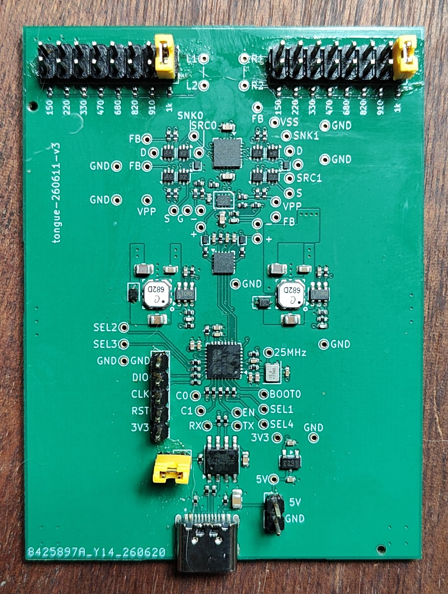
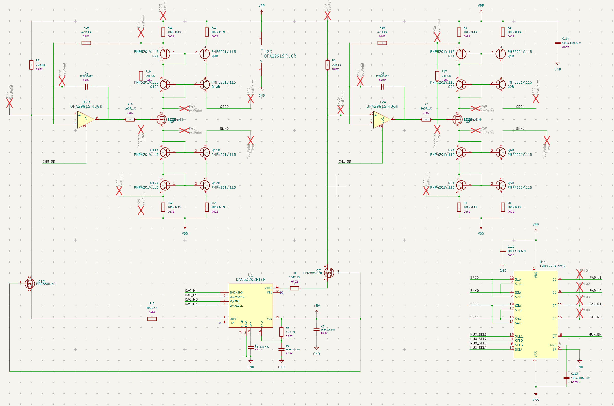
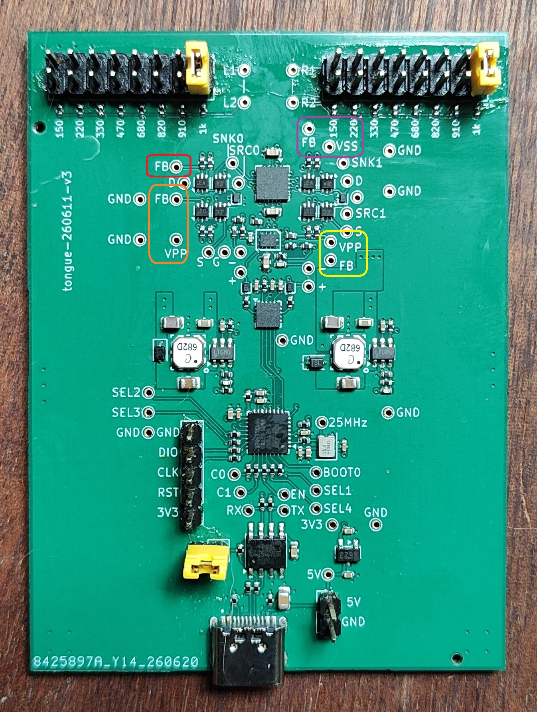
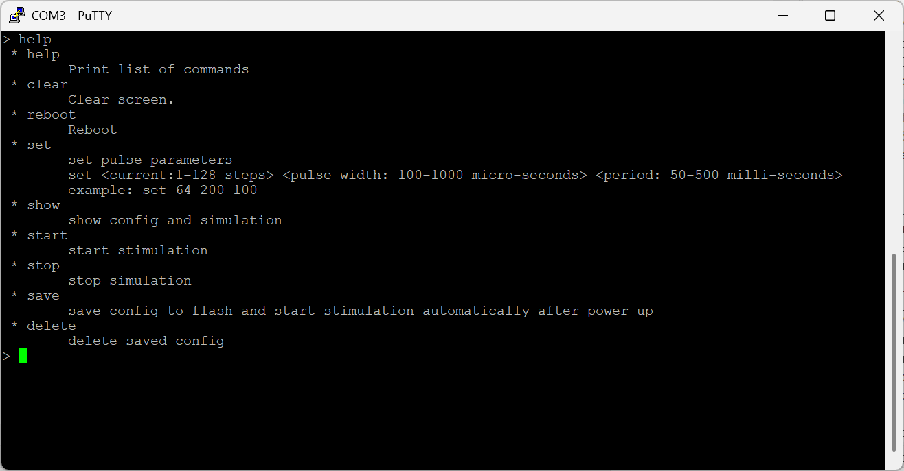
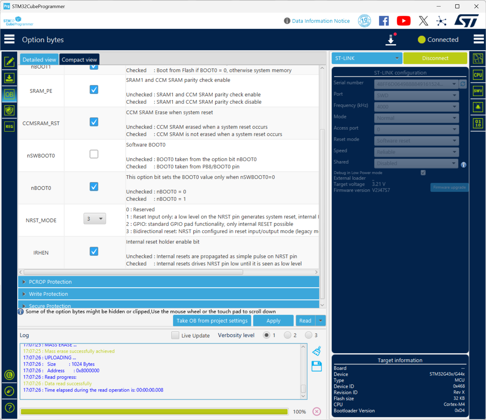

# Board

## 版本标识

左侧的`tongue-260611-v3`是工程版本，左下角文字是立创自动添加的PCB加工标识。

## 跳线设置

注意：千万不要用跳线帽连接USB连接器右侧、丝印写着5V和GND的两个PIN，会短路，可能损坏供电电脑的USB口！！！

图中靠近USB口的黄色跳线帽必须加上，这是MCU和电脑通讯的USB转串口芯片的供电，设计跳线的目的是为了测量电流（功耗）时可以去掉这颗芯片的功耗。如果该跳线没有短接，电脑无法通过USB口和MCU通讯。

图中上边缘两个2x8的Pin Header上的黄色跳线仅供测试使用；图中的两个黄色跳线帽均在1k电阻位置，此时L1和L2之间有1K电阻连接，R1和R2直接也是1K电阻连接。

## DEBUG接口

位于图中底部的黄色跳线帽附近，5PIN，可以用杜邦线连接Debugger（ST-Link V2）。

## 供电与通讯

应在电脑上使用USB连接线接在板上的USB Type C口上；从功率计算上大口（USB Type A）是够的，无论是USB 3.0还是USB 2.0均可，但仍然推荐从电脑上的USB Type C接口连接，因为万一发生短路，USB Type C的电源芯片的保护相对完善，不会损坏；Type A接口不好说。

和之前的板子一样，电脑上可以使用PuTTY连接和发送命令。板上的USB-SERIAL芯片仍然是CH340N，在Windows的设备管理器的串口中可以看到，并据此选择PuTTY中的COM口编号。

# 电路原理

## 原理概述

电路原理可以分为如下阶段：

1. U1，DAC53202芯片，是TI的SmartDAC芯片，可以通过MCU控制产生两个current sink，分别是图中U1的Pin2 OUT0和Pin11 OUT1，这两个PIN接出后首先经过电阻和MOSFET，这些是保护用的，不影响电流大小。
2. 电流源控制了图中R9和R6的电压；
3. 运放OPA2991S把R9和R6的电压分别复制到电阻R11和R3上；
4. 把R11（或R3）上的电流复制到负载上使用了电流镜电路（current mirror），是本产品设计的最关键设计；电流镜的源侧或输入侧， 是电阻R11，PNP管Q9A，Q10A，运放驱动的调节电流的MOSFET Q8，NPN管Q11A和Q12A，以及电阻R12；注意这是正负电压对称的电路；
5. 电流镜的输出通路则是，电阻R13，PNP管Q9B和Q10B，负载（在SRC0和SNK0中间），NPN管Q11B和Q12B，电阻R14；根据电流镜的工作原理，这一路的输出电流和电流镜的源测是一样的；
6. 原理图中右下角的器件U11，TMUX7234，是TI的4通道单刀双掷开关，用于将电极上的电流反向；

## 电流镜

电流镜使用的器件是Nexperia的对管，管子的hFE（放大系数）匹配率是98%，是目前能买到的最高精度的；但是在电流镜的应用里最终电流精度不主要为hFE控制，2%的失配率并不是电流的失配率，电流失配率比这个低很多。

R11/R12/R13/R14是射极负反馈电阻，用于抵消base-emitter之间的PN结的电压失配，这个是对电流镜的精度影响更大的因素；实际使用的电阻100ohm，在电流镜应用中属于比较大的，会浪费一点电压裕量，但是显著提高精度，此处选择的电阻精度很高，是0.1%精度的。该配置在较大电流输出时可以提供非常高的电流匹配度，高于99.5%，在电流较小时（如果小于1mA），会略差一点。

无论在高压侧还是低压侧，都是用了“两层”晶体管，这是电流镜的cascode配置，可以有效消除输入输出负载不同带来的精度恶化，这也是集成电路上广泛使用的配置。

此处没有使用的一种改良电路是，没有使用所谓的beta helper，它指的是通过增加三极管或者MOS管，减少电流镜的基极电流不完全对称的影响。该影响一般是1%以内的，对于本应用来说，其实并没有这么高的精度要求，而且整个应用都算是低电流应用，所以就没有额外增加器件实现beta helper。

本设计中另外一个关键点是高压侧和低压侧均使用了电流镜，这事实上导致负载电压是floating的。因为目标负载是生物负载，在内部有电压的balance，所以要求多电极都必须是floating，这也是本产品设计中最大的难点所在。这里使用对称电流镜就是针对性的解决该问题的。

在大多数类似的需求中，都是使用Howland Pump，该设计的优势是只需要一个运放即可实现推拉电流控制，但是在需求的32.8V以上有效负载电压的要求下，这么大电压范围要求在几个微秒的时间里实现电流摆幅十分困难，会导致使用昂贵的电流模式差分运放并且配合其它电路（电压跟随器）减少电流采样导致的误差，实际上效果远不如本设计。本设计中的电流响应速度完全依赖PNP/NPN管的反应速度，这比任何运放都快，因为它没有外部的控制环路。

最后还需要强调的是，使用电流镜解耦了电流反馈控制和向负载施加电压/电流这两件事，好处是（1）输入测相当于预偏压，即每次加载电压时控制电路并非从零开始；（2）输出测的安全，因为电流镜没有外部控制环路，不会在接触负载的瞬间产生强烈过冲，这对于生物负载或医疗应用是显著收益，提高了安全性。

# 测量

因为是浮动电压，测量有挑战。测量有两种方式：共地测量和浮地测量。

## 共地测量

共地测量指示波器，电脑，和目标板都是共地的。如果使用的是台式机电脑连接目标板，台式机都是三眼插头，外壳接地，示波器也是如此，这会导致目标板的地和他们都连在一起，这时候测量板上的电压测试点VPP和VSS将分别是正20V和负20V左右。

共地测试主要用于测试电流镜输入测的电流是否和设计要求相符。

此时要测量电压只能选择+20V（VPP）或-20V（VSS）做参考，以VPP为例：

1. 首先要把示波器的水平值调整到+20V在屏幕中间的位置，即把示波器表笔的地接在BOARD上的某个GND测试点上，把表笔点在VPP测试点上（板上有两个），左右各一；然后调整vertical position，直到看到+20V电压显示在屏幕中央；
2. 对照原理图，可以测量R11两侧电压，R3两侧电压；分别是两个通道的高压侧，或者测量低压侧的R12和R4两侧的电压。

测试点：橙色方框内是R11两侧，黄色方框内是R3两侧，紫色方框内是R4两侧，R12的一侧是红色方框内的FB，这里没放VSS，VSS可以用紫色方框之内的。

如下图所示，红色，橙色分别为R13和R14的非电源一侧的引脚；黄色和紫色分别是R2和R5的非电源一侧引脚。

PCB上没有提供原理图中R13/R14/R2/R5这四个输出测的电阻的测试，如需测量只能直接量电阻的电极。非硬件工程师没必要使用这个方式测试输出电流，可以使用下节所述的浮地测试方式直接测量负载上的电流。

## 浮地测试

浮地测试有两种方式：

1. 使用笔记本电脑的Type C口给目标板供电，此时笔记本必须不插充电器，或者，使用的充电器的220V插头是两眼的，不是三眼的。或者使用一个2眼的插线板从墙上引出。在这种情况下，应务必使用单独的插线板并且笔记本电脑上不要接任何其它可能产生共地的设备连接。
2. 使用一个可以在低负载下仍保持输出的充电宝给目标板供电。此时需要在目标板上保存一个配置，当前固件在上电时如果发现有保存的配置，会自动启动。注意市售充电宝大多数都有节能设计，即检查到电流很低时不输出电力了。大多数新的充电宝都是通过双击开关键让它保持输出的，但不是所有充电宝都如此，具体的要查产品使用说明。

不管哪一种情况，在浮地之后都可以直接在输出电极上，即L1和L2上，或R1和R2上，接示波器测量。

浮地测试适用于对电流镜输出测的测量。

### 板载负载电阻

图片上板子最上方有两个2x8的Pin Header，如图所示的跳线，选择在L1和L2之间，以及R1和R2之间，均连接了板载的1K电阻。更改跳线帽的位置可以选择其它电阻值，从150Ohm到1K不等。

如果要外接负载，这两个Pin Header上不能有跳线帽上下连接，否则板载电阻会和外部负载构成并联。

# Console命令

## `set`

set命令包含3个参数；

- 第一个current是电流大小，1-128，目前值表示档位，不是物理值，下述；
- 第二个pulse width是正脉冲宽度，单位微秒，负脉冲也是这个宽度；中间的间隙目前是代码里写死的10微秒，例如提供100会产生正脉冲宽度100微秒，然后10微秒间隔，然后负脉冲100微秒；
- 第三个period是周期长度，单位毫秒，写50ms就是20Hz，写500ms就是2Hz；

这三个参数都有取值范围，如图中所示。

## 启动和停止

set命令可以设置一个当前配置，但不是自动启动；需要执行start命令启动，stop命令停止；

## 保存

save命令可以把当前配置保存到flash里。保存在flash里的命令在下次板子上电时会自动开始执行，这个设计是为了使用充电宝进行测试设计的。删除flash上保存的配置的命令是delete。

## `show`

show命令可以显示三个配置，当前用set命令写入的配置（或者刚刚启动时从flash载入的配置），正在跑的电刺激的配置，以及保存在flash上的配置。

## 物理电流大小

DAC53202有四档量程的sink/source电流输出能力，分别是+/-25uA，+/-50uA，+/-125uA，+/-250uA。目前根据需求选择的是+/-125uA这一档。

需求要求的最大电流是一路20mA，反馈电阻（R11）大小100欧姆；对应的电压是2V。参考电阻（R9）的大小是20K，如果要达到2V刚好是100uA。

DAC53202的电流输出精度是8bit的，可同时source/sink，所以做sink时从0-128就是sink 0-125uA的电流，换句话说，设置为128时输出是125uA，对应参考电压和反馈电压是2.5V，这样最大电流是25mA每通道。

| set设置的电流档位 | sink电流 | 期望的负载电流(一个通道) |
| ----------------- | -------- | ------------------------ |
| 51                | 49.8uA   | 9.96mA                   |
| 102               | 99.6uA   | 19.9mA（需求最大值）     |
| 128               | 125uA    | 25mA                     |

# BOOT0烧写

从立创刚刚收到的板子，焊接好必要的连接器后，需要先少些nSWBOOT0，如下图所示；左侧选择OB，在User Configuration中找到nSWBOOT0，去掉勾选。

需要做该修改是因为板上的BOOT0 pin没有上拉电阻，如果使用硬件控制的方式启动，则系统不会从flash启动，这会导致下载或烧录程序后无法启动。

从我手上寄出的板子，有固件的，这一步都已经做过无需再做。

