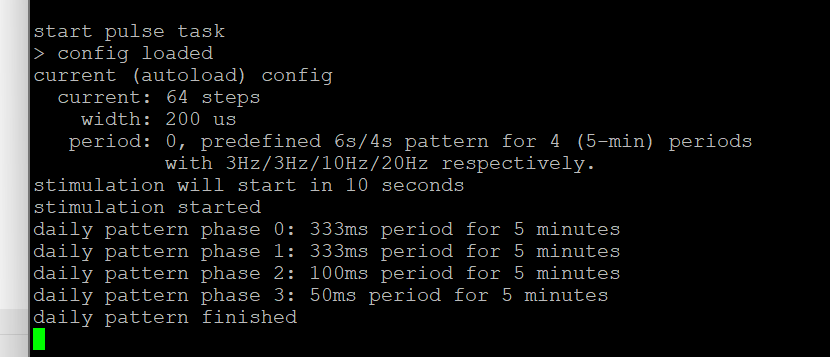

# requirement

- 共4个电极，两个推电流/两个拉电流
- 输出到每个电极上的电流大小、脉宽可设置调整


- 每天使用20分钟，分为4个5分钟，自动执行。
- 每个5min内波形的频率依次为3Hz、 3Hz、 10Hz、 20Hz。
- 每个5min又以每10秒为一个基础单位，10s内有电流脉冲为6s，剩下4s无电流。
  - 以最开始的10s为- 例，0-1s出现3个完全的‘给电流-再回收’波形，1-6s再出现15个完全的‘给电流-再回收’波形；6-10s无电流。10-11s再出现3Hz频率的‘给电流-再回收’波形……

# analysis

全局参数：电流大小，脉宽

可变参数：频率（freq）

定义：一个duty_cycle为10秒，其中6秒on，按照给定频率，电流大小和脉宽执行，4秒off；

# existing code

现存代码的基本设计是：

- 使用vTask_Delay实现周期，不使用timer；
- 使用timer和busy polling实现一次正反脉冲，不使用中断；
- 只有手动启动停止，没有自动任务；

## 配置

定义如下：

```c
// defined in sidekick.h
typedef struct __attribute__((packed)) {
  unsigned int current : 8;
  unsigned int width : 12;
  unsigned int period : 12;
  unsigned int interval;
} pulse_config_t;

```

含义：

- `current`：电流，单位是档位，取值1-128 
  - 51 for 10mA

  - 102 for 20mA (initial design max)

  - 128 for 25mA (implementation max)

- `width`：脉冲宽度，单位微秒，取值100-1000 $\mu$S 

- `period`：周期，单位ms，取值50-500，对应20Hz-2Hz

该结构体最后pack成一个64bit数据存储；`interval`在业务中不使用，在存储时写入MAGIC。

# modification

修改`pulse_config_t`的值范围，允许`period`取0值。

- [x] 修改`CLI_CMD_Set()`，接受`period=0`；
- [x] 修改`cli_cmd_set_binding`的文字说明（命令帮助）;
- [x] 修改`print_config()`；
- [x] 重构`StartPulseTask()`代码；
- [x] 提取`run_endless_mode()` 代码；
- [x] 提取`run_10s()`代码；
- [x] 代码审查；
- [x] refine延迟；

# Testing

- [x] Board bring-up (erase, boot0 bit, download)
- [x] set命令，给period=0参数；
- [x] show命令，打印正确；
- [x] 自动启动增加10s延迟；
- [x] 自动启动增加打印；
- [x] daily模式时每phase增加打印；
- [x] 使用CH0/CH1信号观察下降沿触发跑一个20分钟周期，用示波器观察每个phase的频率



